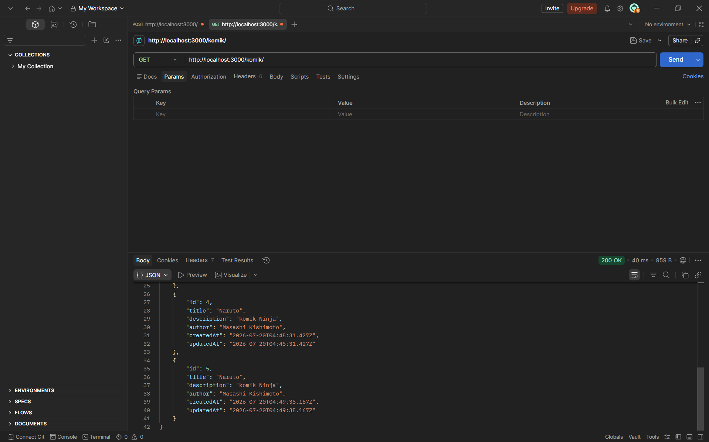
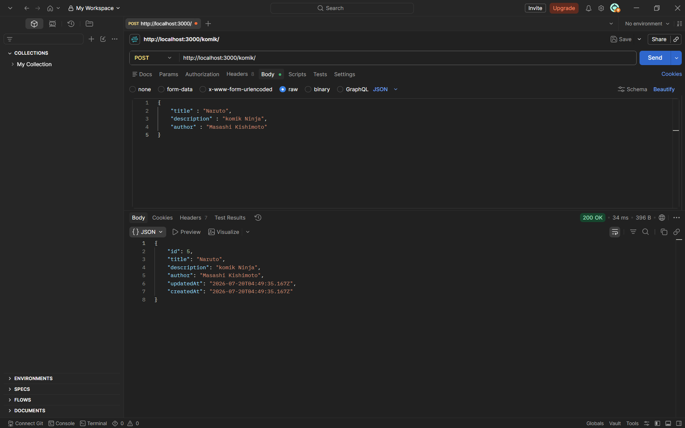
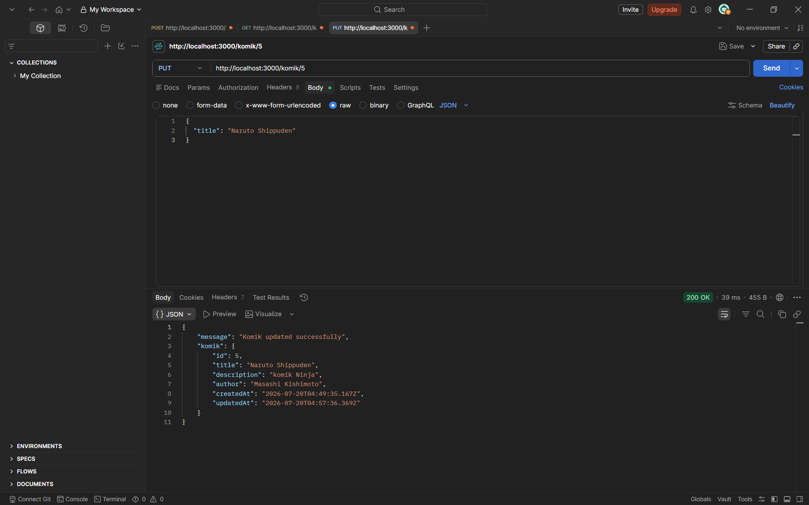
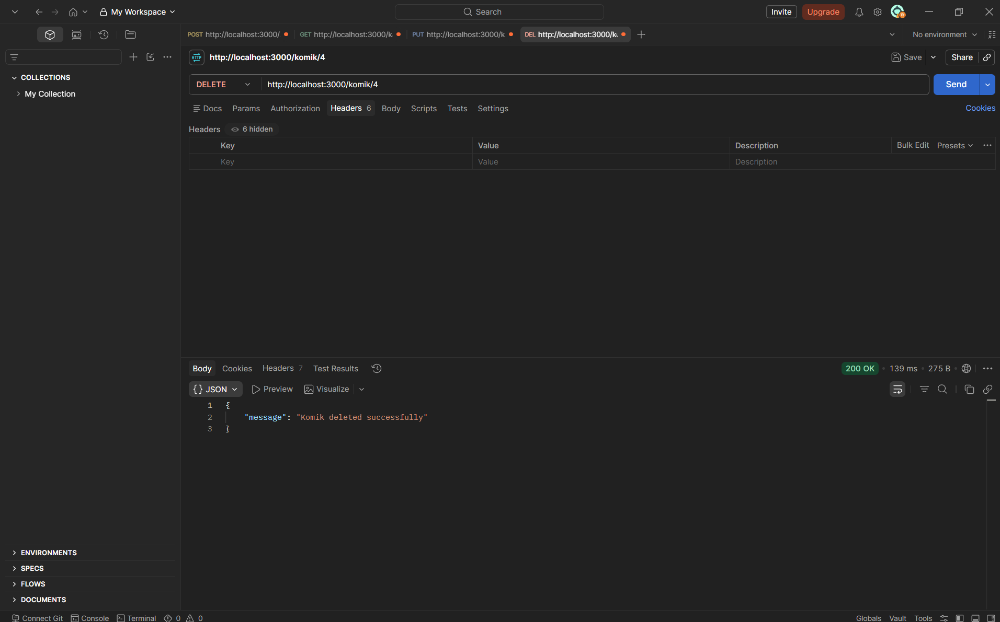

# API ORM - Express + Sequelize + PostgreSQL

**Mata Kuliah:** Pengembangan Web Service  
**Nama:** Ahmad Rassya Maulana  
**NIM:** 20250140157  

## Deskripsi
Rest API sederhana untuk mengelola data komik menggunakan Express 5, Sequelize ORM, dan PostgreSQL.

## Prerequisites
- Node.js
- PostgreSQL
- npm

## Instalasi

1. **Clone atau buka folder project**

2. **Install dependencies**
```bash
npm install express sequelize pg dotenv
```

3. **Install devDependencies**
```bash
npm install --save-dev nodemon sequelize-cli
```

4. **Inisialisasi Sequelize**
```bash
npx sequelize-cli init
```

## Konfigurasi `.env`
```
DB_USER=postgres
DB_PASSWORD=....
DB_DATABASE=perpustakaan
DB_HOST=....
DB_PORT=....
DB_DIALECT=postgres
```

## Menjalankan Server
```bash
npm start
```
Server berjalan di `http://localhost:3000`

## Model - Komik

| Field | Type | Keterangan |
|---|---|---|
| id | INTEGER | Primary Key, Auto Increment |
| title | STRING | Judul komik |
| description | STRING | Deskripsi komik |
| author | STRING | Penulis komik |

## API Endpoints

| Method | Endpoint | Deskripsi | Body (JSON) |
|---|---|---|---|
| GET | `/komik` | Ambil semua data komik | - |
| POST | `/komik` | Tambah komik baru | `{ "title", "description", "author" }` |
| PUT | `/komik/:id` | Update komik by ID | `{ "title", "description", "author" }` |
| DELETE | `/komik/:id` | Hapus komik by ID | - |

## Testing dengan Postman

### GET - Semua Komik


### POST - Tambah Komik


### PUT - Update Komik


### DELETE - Hapus Komik


## Tech Stack
- Express 5
- Sequelize 6
- PostgreSQL (pg)
- dotenv
- nodemon
